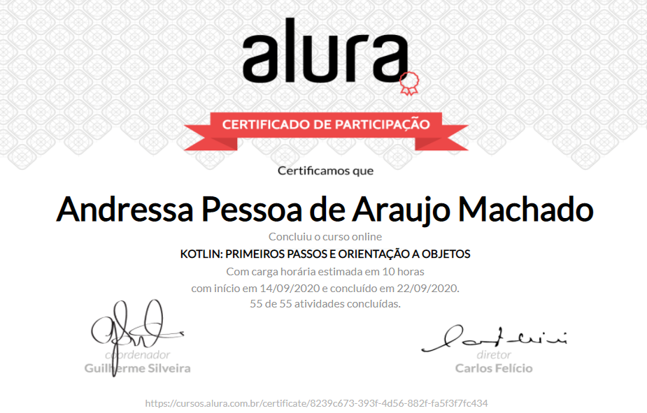

# ByteBank
Very simple bank system to getting started with Kotlin. 

`Note: this code was developed during an introductory online kotlin course offered by Alura e-learning platform.`

**Title:** Kotlin: First Steps and Object Orientation

**Workload:** 10 hours

doc: https://kotlinlang.org/docs/reference/basic-syntax.html
